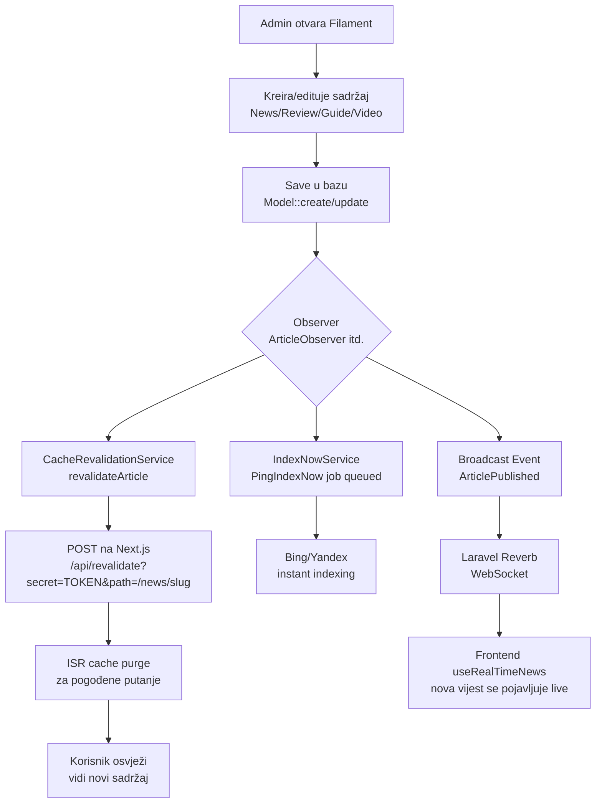
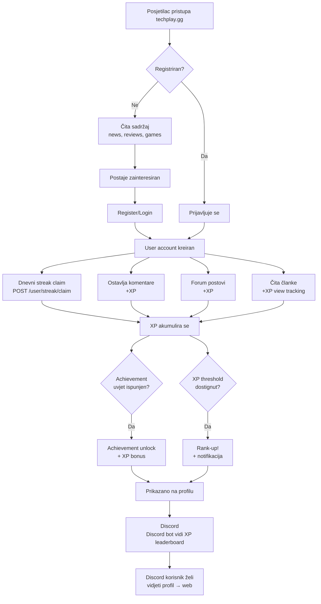
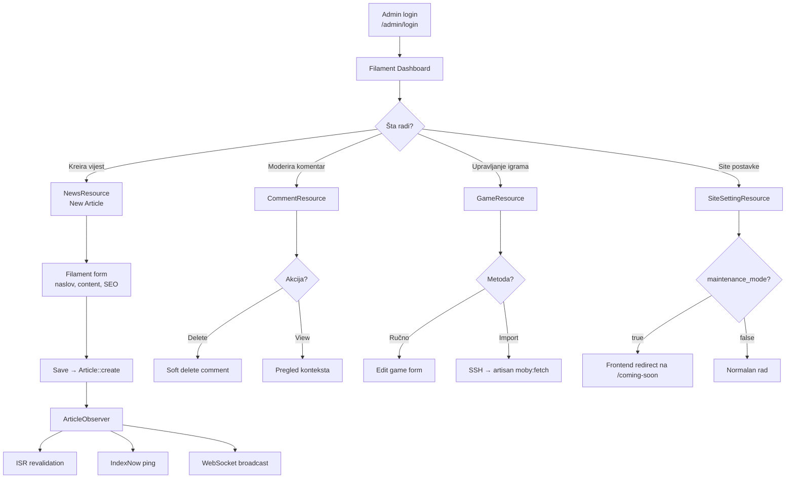
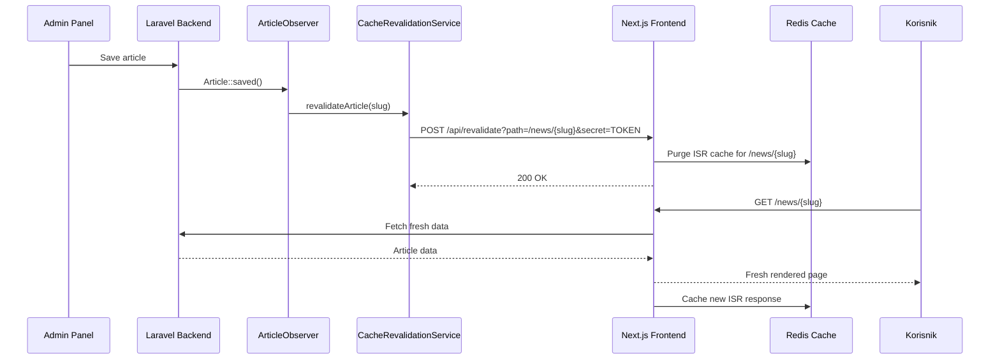

# 30 — Architecture Diagrams

## 1. High-level System Architecture

```mermaid
graph TB
    subgraph "Internet"
        USER[👤 Korisnik / Browser]
        DISCORD_USER[👤 Discord korisnik]
        ADMIN_USER[👤 Admin]
    end

    subgraph "TechPlay Frontend (Next.js 16)"
        FRONTEND[techplay.gg<br/>Next.js App Router<br/>ISR + SSR]
    end

    subgraph "TechPlay Backend (Laravel 12)"
        API[api.techplay.gg<br/>REST API /api/v1]
        ADMIN[/admin<br/>Filament v5]
        REVERB[Laravel Reverb<br/>WebSocket Server]
    end

    subgraph "Data Layer"
        PG[(PostgreSQL<br/>Baza podataka)]
        REDIS[(Redis<br/>Cache + Queue)]
    end

    subgraph "Discord Bot"
        BOT[Professor Buffy<br/>discord.js v14]
    end

    subgraph "External APIs"
        MOBY[MobyGames API]
        RAWG[RAWG API]
        BLIZZARD[Blizzard/Battle.net API]
        STEAM[Steam API]
        PAYPAL[PayPal API]
        OPENAI[OpenAI / Gemini / Groq]
        INDEXNOW[IndexNow<br/>Bing/Yandex]
        DISCORD_API[Discord API]
    end

    USER -->|HTTP| FRONTEND
    ADMIN_USER -->|HTTP| ADMIN
    DISCORD_USER -->|Commands/Events| BOT

    FRONTEND -->|REST API HTTP| API
    FRONTEND <-->|WebSocket| REVERB
    ADMIN -->|Eloquent| PG

    API -->|Eloquent| PG
    API -->|Cache/Queue| REDIS
    API <-->|Events| REVERB

    BOT -->|HTTP /api/v1/discord/*| API
    BOT <-->|Discord Events| DISCORD_API

    API --> MOBY
    API --> RAWG
    API --> BLIZZARD
    API --> STEAM
    API --> PAYPAL
    API --> OPENAI
    API --> INDEXNOW
```

---

## 2. Content Publishing Flow



---

## 3. User Engagement Flow



---

## 4. Game Database Flow

```mermaid
flowchart LR
    subgraph "Import (jednom/periodično)"
        A[php artisan moby:fetch] --> B[MobyGamesService]
        B --> C[MobyGames API]
        C --> D[games tabela<br/>PostgreSQL]
        E[php artisan moby:enrich] --> F[MobyEnrichmentJob]
        F --> C
    end

    subgraph "Frontend prikaz"
        G[/games stranica] --> H[GET /games?genre=&platform=]
        H --> I[GameController::index]
        I --> D
        D --> J[Game cards prikaz]

        K[/games/slug stranica] --> L[GET /games/slug]
        L --> M[GameController::show]
        M --> D

        subgraph "Screenshoti"
            M --> N{Lokalni<br/>screenshoti?}
            N -->|Da| O[Lokalni prikaz]
            N -->|Ne| P[GET /games/rawg/slug]
            P --> Q[RawgService]
            Q --> R[RAWG API]
        end
    end

    subgraph "SEO"
        D --> S[Svaka igra = ISR stranica]
        S --> T[Game JSON-LD schema]
        S --> U[Sitemap inclusion]
    end

    subgraph "User interaction"
        D --> V[UserGame kolekcija]
        D --> W[GameRating ocjene]
        D --> X[Release Calendar]
    end
```

---

## 5. Discord Bot Flow

```mermaid
flowchart TD
    subgraph "Discord Server"
        A[Discord korisnik] -->|Slash command| B[/profile /daily /search itd.]
        A -->|Piše poruku| C[MessageCreate event]
        A -->|Rich Presence| D[PresenceUpdate event]
    end

    subgraph "Professor Buffy Bot"
        B --> E[handlers/commands.ts<br/>Dispatcher]
        C --> F[XpService<br/>15 XP / poruka / 60s cooldown]
        D --> G[setupPresenceTracking]

        subgraph "Background Services"
            H[PollingService<br/>svakih 600s] -->|GET /news?since=| I
            J[TriviaService<br/>scheduled] -->|Trivia question| K[Discord channel]
            L[RecapService<br/>tjedni] -->|Weekly recap| M[RECAP_CHANNEL_ID]
            N[ServerStatsService] -->|Update voice channel| O[📊 Members: 1234]
        end
    end

    subgraph "TechPlay Backend"
        I[API /api/v1/discord/*]
        E -->|/profile → GET /discord/user/discordId| I
        F -->|POST /discord/xp| I
        G -->|POST /discord/presence| I
        I --> P[(PostgreSQL)]
    end

    subgraph "Discord Output"
        H -->|News embed| Q[LATEST_NEWS_CHANNEL_ID]
        E -->|Profile embed| R[Reply to user]
    end
```

---

## 6. Admin Workflow Flowchart



---

## 7. ISR Revalidation Flow


