```mermaid
flowchart TB

    %% ─── KORISNICI ───────────────────────────
    V["👤 Posjetilac"]
    U["🔐 Registrovan korisnik"]
    ADMU["⚙️ Admin / Editor"]
    DU["💬 Discord korisnik"]

    %% ─── FRONTEND ────────────────────────────
    subgraph FE["🖥️  FRONTEND — Next.js 16 — techplay.gg"]
        FN["📰 News · Reviews · Guides · Tech · Videos"]
        FGP["🎮 Game Database · Release Calendar"]
        FTO["🔧 WoW Analyzer · Backlog AI · Wrapped · Compare"]
        FSH["🛒 Shop · Giveaways"]
        FAU["🔑 Login / Register / OAuth callback"]
        FRT["⚡ Real-time WebSocket hooks (8x useRealTime*)"]
        FSEO["🔍 GlobalSeo · JSON-LD · OG tags · PageSeo"]
        FMW["🛡️ middleware.ts — Maintenance mode check"]
    end

    %% ─── ADMIN PANEL ─────────────────────────
    subgraph ADMIN["🔧  ADMIN PANEL — Filament v5 — techplay.gg/admin"]
        AC["Sadržaj: News · Reviews · Guides · Tech · Videos · Media"]
        AG["Igre: GameResource — ručni edit + import trigger"]
        AFORUM["Forum: Kategorije · Threadovi · Komentari · Postovi"]
        AUSER["Korisnici: Users · Ranks · Achievements · Roles"]
        ASEO["SEO + System: PageSeo · Redirects · SiteSettings · Ads"]
        ACOM["Commerce: Products · Orders · Giveaways · SupportTiers"]
    end

    %% ─── BACKEND API ─────────────────────────
    subgraph BE["⚙️  BACKEND — Laravel 12 — api.techplay.gg/api/v1"]
        BA1["Content API: GET /news · /reviews · /guides · /tech · /videos"]
        BA2["Game API: GET /games · /games/calendar · /games/hub · RAWG proxy"]
        BA4["User API: /auth · /user · /presence · /leaderboard · /notifications"]
        BA5["Gamification: XpService · StreakCtrl · QuestCtrl · AchievementSvc · SeasonCtrl"]
        BA6["Commerce: /shop · /paypal · /giveaways · /wow/analyze · /backlog"]
        BA7["Discord API: /discord/xp · /discord/leaderboard · /discord/presence · /discord/daily"]
        BI1["Observers x16: publish trigger → CacheRevalidationService → ISR purge + IndexNow job"]
        BI2["Laravel Reverb — WebSocket server — Pusher protokol"]
        BI3["Job Queue: PingIndexNow · FlushViewCounters · MobyEnrichment · SyncSteamLibrary · SendGiveawayReminders"]
        BI4["Cron: PublishScheduledArticles · GenerateSitemap · SyncAchievements · SnapshotReputation · CleanOldViews"]
        BI5["Services: SanitizationSvc · SchemaService · IndexNowService · ImageService · PayPalService"]
    end

    %% ─── DATABASE ────────────────────────────
    subgraph DATABASE["🗄️  BAZA — PostgreSQL + Redis"]
        DB1["Content: articles · reviews · guides · videos · categories · seo_metas"]
        DB2["Games: games TEXT-ARRAY · game_ratings · user_games · game_lists · game_external_ids"]
        DB4["Gamification: achievements · quests · seasons · presences · bounty_transactions · reputation_snapshots"]
        DB5["Commerce: products · orders · giveaways · giveaway_entries · support_tiers"]
        DB6["System: site_settings · notifications · media · ad_campaigns · redirects"]
        REDIS[("Redis — Cache + Queue + Session")]
    end

    %% ─── DISCORD BOT ─────────────────────────
    subgraph BOT["🦉  DISCORD BOT — Professor Buffy — discord.js v14"]
        B1["PollingService — news polling svakih 600s → Discord news channel"]
        B2["XpService — 15 XP/poruku · 60s cooldown → POST /discord/xp"]
        B3["TriviaService · RecapService tjedni · ChallengeService"]
        B4["ServerStatsService — update voice channel naziva sa live stats"]
        B5["Slash komande: /profile /daily /leaderboard /search /latest /forum /giveaways /link /sync"]
        B6["Event handleri: setupWelcome · setupModeration · setupPresenceTracking · setupChallengeReactions"]
    end

    %% ─── VANJSKE INTEGRACIJE ─────────────────
    subgraph EXT["🌐  VANJSKE INTEGRACIJE"]
        E1["MobyGames API — game import · primarni izvor podataka"]
        E2["RAWG API — screenshots + movies · fallback"]
        E3["Blizzard API — WoW character data za analyzer"]
        E4["Steam Web API — library import + presence polling"]
        E5["PayPal API — shop narudžbe + subscription billing"]
        E6["Discord API — OAuth login + bot events"]
        E7["Gemini 2.5 Flash + GPT-4 Turbo + Groq — AI analiza"]
        E8["IndexNow — Bing + Yandex instant indexing"]
        E9["RaiderIO — Mythic+ podaci za WoW analizu"]
    end

    %% ─── SEO EKOSISTEM ───────────────────────
    subgraph SEO["🔍  SEO EKOSISTEM"]
        S1["ISR cache po stranici - revalidate on publish"]
        S2["JSON-LD: NewsArticle · Review · Organization · WebSite · VideoGame"]
        S3["XML Sitemap — GenerateSitemap cron komanda"]
        S4["IndexNow ping — pri svakom publishu sadržaja"]
        S5["PageSeo override — admin definisan per-path"]
    end

    %% ─── VEZE: Korisnici → Frontend ──────────
    V -->|"čita sadržaj"| FN
    V -->|"browsea igre"| FGP
    U -->|"auth + komentari + forum"| FCO
    U -->|"koristi alate"| FTO
    U -->|"kupuje"| FSH
    V & U -->|"login / register"| FAU
    ADMU -->|"HTTPS browser"| ADMIN
    DU -->|"slash komande + poruke"| BOT

    %% ─── VEZE: Frontend → Backend API ────────
    FN -->|"GET /news · /reviews · /guides · /tech · /videos"| BA1
    FGP -->|"GET /games · /calendar"| BA2
    FCO -->|"GET POST /forum · /comments · /friends · /messages"| BA3
    FAU -->|"POST /auth/login · /register · OAuth"| BA4
    FTO -->|"POST /wow/analyze · /backlog/suggest"| BA6
    FSH -->|"GET POST /shop · /giveaways · /paypal"| BA6
    FRT <-->|"WebSocket Pusher protokol"| BI2

    %% ─── VEZE: Admin → Database (direktno Eloquent) ───
    AC & AG & AFORUM & AUSER & ASEO & ACOM -->|"Eloquent ORM — direktan pristup"| DATABASE

    %% ─── VEZE: Backend → Database ────────────
    BA1 & BA2 & BA3 & BA4 & BA5 & BA6 & BA7 -->|"Eloquent ORM"| DATABASE
    BI3 & BI4 -->|"Redis cache + job queue"| REDIS

    %% ─── VEZE: Publish flow → SEO ────────────
    BI1 -->|"POST /api/revalidate + secret"| S1
    BI1 -->|"queue PingIndexNow job"| S4
    BI5 -->|"SchemaService inject"| S2
    BI4 -->|"daily GenerateSitemap"| S3
    ASEO -->|"per-path override"| S5

    %% ─── VEZE: Discord Bot → Backend ─────────
    B1 -->|"GET /api/v1/news"| BA1
    B2 -->|"POST /discord/xp"| BA7
    B5 -->|"GET /discord/leaderboard · /discord/daily"| BA7
    B6 -->|"POST /discord/presence"| BA7

    %% ─── VEZE: Backend → Vanjske integracije ──
    BA2 -->|"MobyGamesService — import"| E1
    BA2 -->|"RawgService — live proxy"| E2
    BA6 -->|"BlizzardService"| E3
    BI3 -->|"SteamService — SyncSteamLibrary"| E4
    BA6 -->|"PayPalService"| E5
    BA4 -->|"SocialAuthController OAuth"| E6
    BOT <-->|"bot events + slash cmds"| E6
    BA6 -->|"GeminiService + OpenAIService"| E7
    BI1 -->|"IndexNowService"| E8
    BA6 -->|"RaiderIOService"| E9

    %% ─── STILOVI ─────────────────────────────
    classDef fe fill:#0d1b2a,stroke:#4a9eff,color:#e0e0e0
    classDef be fill:#0d1b2a,stroke:#9b59b6,color:#e0e0e0
    classDef adm fill:#0d1b2a,stroke:#e94560,color:#e0e0e0
    classDef db fill:#0d1b2a,stroke:#00b4d8,color:#e0e0e0
    classDef bot fill:#0d1b2a,stroke:#5865F2,color:#e0e0e0
    classDef ext fill:#0d1b2a,stroke:#f77f00,color:#e0e0e0
    classDef seo fill:#0d1b2a,stroke:#2ec4b6,color:#e0e0e0
    classDef usr fill:#0d1b2a,stroke:#57cc99,color:#e0e0e0

    class FN,FGP,FCO,FTO,FSH,FAU,FRT,FSEO,FMW fe
    class BA1,BA2,BA3,BA4,BA5,BA6,BA7,BI1,BI2,BI3,BI4,BI5 be
    class AC,AG,AFORUM,AUSER,ASEO,ACOM adm
    class DB1,DB2,DB3,DB4,DB5,DB6,REDIS db
    class B1,B2,B3,B4,B5,B6 bot
    class E1,E2,E3,E4,E5,E6,E7,E8,E9,E10 ext
    class S1,S2,S3,S4,S5 seo
    class V,U,ADMU,DU usr
```

# TechPlay.gg — Full Platform Map

Kompletan pregled ekosistema: frontend, backend, admin, baza, Discord bot, SEO i vanjske integracije.

---

---

## Legenda

| Boja okvira | Dio sistema |
|---|---|
| 🔵 Plava | Frontend — Next.js 16 |
| 🟣 Ljubičasta | Backend API — Laravel 12 |
| 🔴 Crvena | Admin panel — Filament v5 |
| 🩵 Cyan | Baza podataka — PostgreSQL + Redis |
| 💙 Indigo | Discord bot — Professor Buffy |
| 🟠 Narandžasta | Vanjske integracije |
| 🩦 Teal | SEO ekosistem |
| 🟢 Zelena | Korisnici |

---

## Ključni tokovi

**Publish flow:**
Admin → Filament save → ArticleObserver → CacheRevalidationService → POST /api/revalidate → ISR purge + IndexNow ping + WebSocket broadcast → korisnici vide promjenu live

**XP flow:**
Korisnik komentira/čita → XpService → users.xp update → rank provjera → achievement provjera → Notification event → frontend bell

**Game import flow:**
`php artisan moby:fetch` → MobyGamesService → games tabela (TEXT[] arrays) → ISR game stranice → Sitemap

**Discord bridge:**
Discord poruka → XpService (bot, TypeScript) → POST /discord/xp → backend XpService (PHP) → users.xp → rank sync